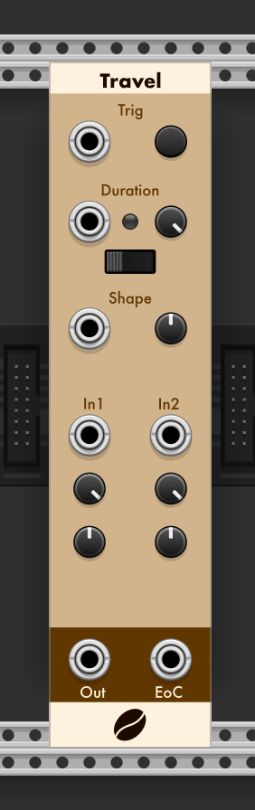
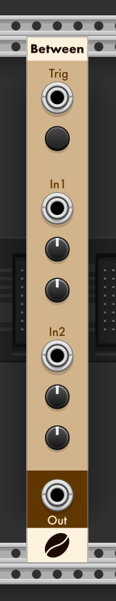
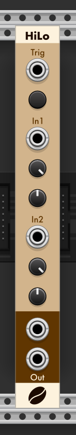

# CoffeeVCV Modules

Modules for [VCV Rack](https://github.com/VCVRack/Rack), an open-source Eurorack-style virtual modular synthesizer:

  - [Travel](#Travel)
  - [Between](#Between)
  - [HiLo](#HiLo)

##  Travel

Travel take two values and outputs an interpolation over a defined period of time.

The two values are provided via inputs In1 and In2 which are modified by Scale and Offset.
If no input if provided the default value is 0v, which cn be modified by Offset.

The cycle is started either the manual or CV Trig input.
The cycle stops when the duration time it met.
Duration is set manaully or via CV.
The default scale for duration is 1 and can be set to 1, 10 or 100.
A CV input to duration of 2v, with scale set to 1, will set a 2 second duration.

During the cycle the LED will indicate the cycle position, brightest at the start, and dims to off when the cycle completes. 

At the end of the cycle the EoC Output will pulse. Connecting the EOC to the input trigger will create a repeating cycle.

In the context menu, there's an option to select either Track or 
Hold.  The default is Hold, this fixes the input values until the end of the cycle.
Selecting Track will enable the input values to change during the cycle. 

The Shape CV and parameter, control the shape of the interpollation.  The default shape is linear.  -5v and 5v will changen the rate of interpolation using an expotential function.

In these images, orange is the interpolated value, and blue is the EoC pulse.

##  Between

Between will provide a random value, limited by two input values.

Output is set when either trigger manually or via clock or trigger input.

The limit values are either set via trimpots or provided as inputs to In1 or In2.
In either case, they are adjusted by Offset.

Manually setting CV1 to +5.0 and offset to -5v, will result in 0v.

In this example, green is a 0v reference, and blue is output from Random, being triggered by a clock.

In1 = -5, In2 = 5

##  HiLo

HiLo takes two inputs and outputs the highest and lowest value of either input.

Output is set when triggered manaully or via a clock.

In1 and In2 are each first adjsusted via Scale and then Offset.
If no CV input is provided, Offset can be used to set a value (-5v to 5v).
