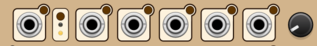
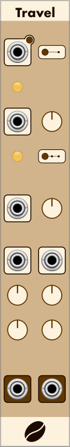
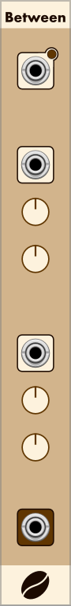

# CoffeeVCV Modules

Modules for [VCV Rack](https://github.com/VCVRack/Rack), an open-source Eurorack-style virtual modular synthesizer:

  - [Together](#Together)
  - [Travel](#Travel)
  - [Between](#Between)
  - [HiLo](#HiLo)
  - [Some](#Some)
  

---
##  Together

Together, is a fun Euclidian sequencer which provides a bank of dividers, resulting in triggers and gates, and 4 CV outputs.

### Features
* Clock \ Trigger input
* Reset input with manual
* 8 Clock dividers 
* 8 outputs as trigger and gates
* Global trigger output
* Global gate output
* 4 columns of adjustable values
* 4 output CVs
* Global CV output scaling
* Global CV output offset
* Randomization of dividers
* Randomization of CV values
* Randomization of tigger outs
* CV Inputs with manual triggers

### Clock and Reset
At the top right of the module, there are two inputs, one to supply the module with a clock or trigger, the other is to recive a reset signal.  In the top right of each input control there a small button that can be used to manually trigger input.

This image show the clock connected and active, and reset is not connected.

### Clock Dividers / Steps
The large knobs on the left configure the dividers which can be set to trigger every 1 - 16 steps. 
Each divider has three indicators.
* Large yellow light - the step is triggering
* Smallest yellow light - the divider is active (set > 0)
* Orange light - divider is locked, and will not be changed by triggered adjustment.

This image show three dividers.
1. Not configured.
2. Configured and triggering.
3. Locked, configured and not triggering.

### Divider output
In it's simplest form this sequencer will provide trigger or gate output.  
These are located on the far right, each divider row also has a probability control.  When probability is set to 1.0, output will always occur when a step activates.  A divider with a setting of 0.5 will output 50% of the time, 0.0 will never produce output.

Small red and green lights, indicate if the probability blocked or allowed output.

The image below shows the output for three dividers.  
1. Probability 100%, trigger is firing and connected.
2. Probability 100%, gate is active.
3. Probability is low, and trigger is not firing.

### Global Divider Output
In the bottom right of the module, there two other outputs which will always be active if any output in their column is active.

If a divider doesn't activate beacuse probability has blocked it, the global output will not fire unless a different divider is active, and not blocked.

This image shows the global trigger not firing, and the global gate is active.

### Group CV columns and output
In the centre there's matrix if 4 x 8 CV adjustment knobs.  The range for each is -1.0v to 1.0v.  At the bottom of the columns there are 4 CV outputs.

When the clock triggers the dividers steps, the CV value are combined and shared via the column output.
Only values for triggering rows are included in the result.

In this image there are 4 CV settings, and diverders are set to trigger on steps 5,4,3 and 2.  The scope shows the values combining as the dividers trigger, creating an interesting rhythem.

There are 4 of these columns, each operate independantly.

### Scale and Offset
At the bottom left of the module are two adjust ment knobs, which alter the final results of all the column outputs.  Both have a range of -5.0v to +5.0v.
Scale multiplies the output. 
By default the scale is set to 1, if it is set to 2, results will be doubled.
Offset adds or subtracts a value from the result, the default is 0.0v.

### Nudge and Random
This sequencer is able to small or large changes to the divider step setting, and the 4x8 matrix.  There are two modes, which can be applied to various groups of controls.

Modes
* Random - The controls value is replaced with a random value, in the range of the control.
* Nudge - The controls value is replaced with a modified values, based on the current value.

Groups
* All the dividers, except the locked dividers.
* Each column of CV controls
* Each row of CV controls
* All the CV controls

The top row of the module has the controls to adjust dividers and groups.  Most are CV Inputs with manul triggers.

From left to right the controls are.

1. Divider adjust
2. Mode 
3. Group 1 adjust
4. Group 2 adjust
5. Group 3 adjust
6. Group 4 Adjust
7. All groups and row adjust
8. Adjustment limit

#### Divider Adjust
Trigger will change all the dividers that are not locked.
* Random 0 - 16
* Nudge -1 or +1

#### Mode
This is push button, with two indicators.
Activating this with toggle between Nudge and Random
Yellow at the top is Nudge Mode.
Yellow at the bottom is Random.

#### Groups 1 - 4
Each of these will replace all the CV values with an adjusted value.
* Random 0.0v - 1.0v
* Nudge +/- the value of [Adjustment Limit](#AdjustmentLimit)

#### All rows and columns 
This will adjust every control in the 4 x 8 matrix.

#### <a name="Adjustment Limit">Adjustment Limit</a>
This control set the amount that will be added to, or substracted from CV control, when mode is Nudge.  The default is 0.05v.

#### Row Adjustment 
To the immediate right of column 4, is the triggers for each row.  These operate in the same way as columns.

---

##  Travel

Travel take two values and outputs an interpolation over a defined period of time.

The two values are provided via inputs In1 and In2 which are modified by Scale and Offset.
If no input if provided the default value is 0v, which cn be modified by Offset.

The cycle is started either the manual or CV Trig input.
The cycle stops when the duration time it met.
Duration is set manaully or via CV.
The default scale for duration is 1 and can be set to 1, 10 or 100.
A CV input to duration of 2v, with scale set to 1, will set a 2 second duration.

During the cycle the LED will indicate the cycle position, brightest at the start, and dims to off when the cycle completes. 

At the end of the cycle the EoC Output will pulse. Connecting the EOC to the input trigger will create a repeating cycle.

In the context menu, there's an option to select either Track or 
Hold.  The default is Hold, this fixes the input values until the end of the cycle.
Selecting Track will enable the input values to change during the cycle. 

The Shape CV and parameter, control the shape of the interpollation.  The default shape is linear.  -5v and 5v will changen the rate of interpolation using an expotential function.

In these images, orange is the interpolated value, and blue is the EoC pulse.

---
##  Between

Between will provide a random value, limited by two input values.

Output is set when either trigger manually or via clock or trigger input.

The limit values are either set via trimpots or provided as inputs to In1 or In2.
In either case, they are adjusted by Offset.

Manually setting CV1 to +5.0 and offset to -5v, will result in 0v.

In this example, green is a 0v reference, and blue is output from Random, being triggered by a clock.

In1 = -5, In2 = 5

---
##  HiLo

HiLo takes two inputs and outputs the highest and lowest value of either input.

Output can be set via manaul or CV trigger.

In1 and In2 are each first adjusted via Scale and then Offset.
If no CV input is provided, Offset can be used to set a value (-5v to 5v).

In the context menu, there's an option to select either Track or 
Hold.  The default is Hold, this mode requires Trigger to be activated to take a sample.
In Track mode, inputs are continually sampled, but only if there's no Trigger CV connected.

Here's an example of two overlapping wave inputs, and the resulting histest and lowest values.

---
##  Some

The Some module accepts up to 8 inputs, and will output 8 or less depending on a Probability parameter.
The selection is randomised and made using the manual or CV trigger.
Only connected inputs are included in the selection process.  Selected inpute are indicated with an illuminated green led.

In this example all 8 are connected, Probability is set to 0.5.
Only 4 inputs are passed through.  When triggered again, a different 4 will be selected.

In this example with only 4 connected, Probability is still 0.5, so only 2 inpute are selected.

